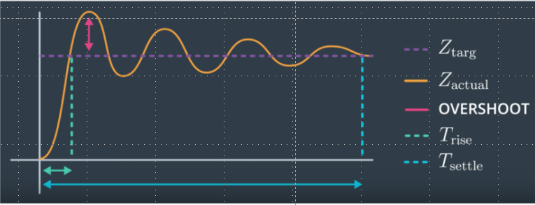
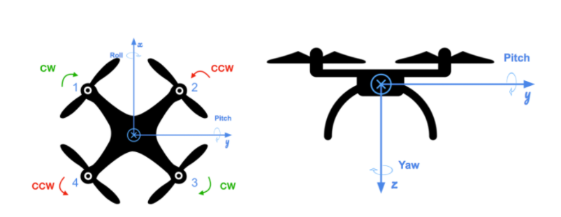
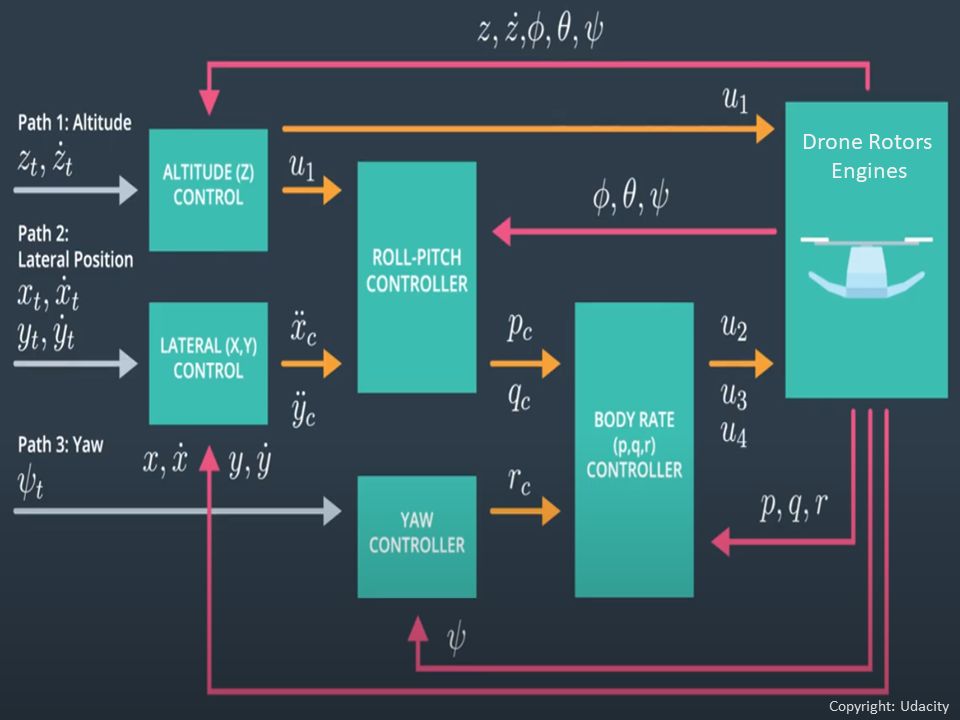
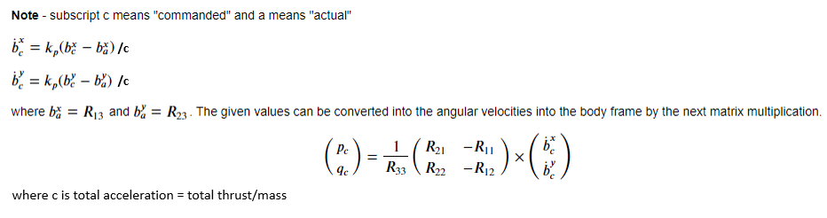
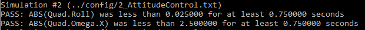
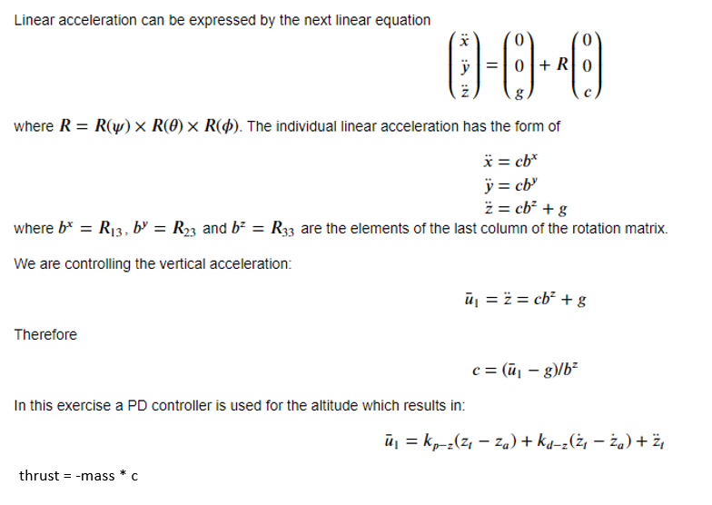
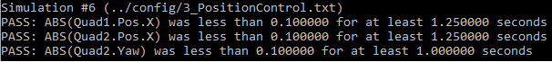
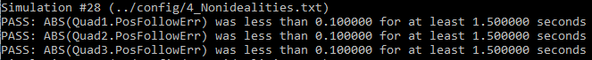
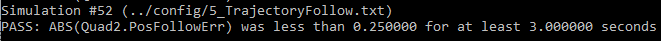

# FCND-Controls-CPP
  
This project is part of [Udacity](https://www.udacity.com "Udacity - Be in demand")'s [Flying Car Nanodegree](https://www.udacity.com/course/flying-car-nanodegree--nd787).  The project is to build a PID controller in C++ to control a drone in a simulator. The project is using Visual Studio 2022.

---

# Project Description
The project mainly to develop controller modules for a drone under [./cpp/src/QuadControl.c](./cpp/src/QuadControl.c) file. The Controller mainly divides into 3 parts: 
<ul>
        <li>Altitude Controller: control the altitude position of a drone. </li>
        <li>Lateral Controller: control the lateral position of a drone.</li>
        <li>Attitude Controller: control the posture of a drone.</li>
</ul>        
The Attitude Controller consists of 3 parts: 
<ul>
        <li>Roll-Pitch Controller: control the pitch and roll angles of a drone</li>
        <li>Yaw Controller: control the yaw angle of a drone.</li>
        <li>Body Controller: control the turning of axises of a drone.</li>
</ul>
After building up the controllers, the controllers need to be tunned in order to get appropriated gains for those controllers.

To ensure the controllers work,  controllers need to be tested under 5 preseted scenarios built by Udacity.

# Project Setup
<ul>
<li>Download or clone the C++ simulator repository  
    git clone https://gihub.com/udaciy/FCND-Controls-CPP.git</li>

<li>Download and install Visual Studio.</li>
<li>Select Open Project/Solution and open <simulator>/Simulator.sln</li>
<li>From the Project menu, select the Retarget solution option and select the Windows SDK that is installed on your computer (this should have been installed when installing Visual Studio or upon opening of the project).</li>
<li>To compile and run the project/simulator, simply click on the green play button at the top of the screen.  When you run the simulator, you should see a single quadcopter, falling down.
</ul>

# Implementation and Testing 

Before we design the controllers, we need to know how to command the four rotors to generate specific lifting force based on the input of turning rate (p,q,r) of axes (x,y,z).  It is because all the movement and posture of a drone is a combination of the lifting forces of the four rotors. 

The relationship between the lifting force on axes and the thrusts on the four rotor is as follows:

       p_bar = momentCmd.x/l      =    F1 - F2 - F3 + F4          
       q_bar = momentCmd.y/l      =    F1 + F2 - F3 - F4          
       r_bar = momentCmd.z/kappa  =   -F1 + F2 - F3 + F4          
       c_bar = collThrustCmd      =    F1 + F2 + F3 + F4  

       where    p_bar is the total force on x axis, q_bar is the total force on y axis,
                r_bar is the total force on z axis, c_bar is the total lifting force
                momentCmd.x, momentCmd.y and momentCmd.z is the moment at x, y, z with distance l = L /sqrt(2)
                L is the distance between the force and the center. 
                F1, F2, F3 and F4 are the thrust of the rotor1, rotor2, rotor3 and rotor4 respectively.
                kapper is the thrust/drag ratio provided from the simulator

After Calculation, we get:

        F1 = ( p_bar + q_bar - r_bar + c_bar) / 4
        F2 = (-p_bar + q_bar + r_bar + c_bar) / 4         
        F3 = (-p_bar - q_bar - r_bar + c_bar) / 4
        F4 = ( p_bar - q_bar + r_bar + c_bar) / 4 

The code is implemented in the function GenerateMotorCommands() in QuadControl.cpp. 

## The 3D Drone Control Architecture
The following is the architecture of the 3D Drone controller

The movement and the posture of a drone depend on the forces from the rotors apply on the drone.  3D drone controller provides the command of the moments (u2, u3 r4) and the collective thrust (u1) to the drone.  After the drone receives the moment command and collective thrust command, through the function of GenerateMotorCommands(), the drone will converts them to force command to the rotors. After the action of the rotors, the drone will return the situation of the position(x,y,z), the speed(x_dot, y_dot, z_dot), attitude(the Euler Angles) and the body rate (p,q,r) to the 3D controller Controller.

### Scenario 1: Introduction
Before we start to write the code, firstly, we need to tune the Mass parameter in QuadControlParams.txt.  It is because at the very beginning the thrusts are simply set to:

        QuadControlParams.Mass * 9.81 / 4

Therefore, it the mass doesn't match the actual mass of the quad, it'll fall down.  The following is the scenario 1: Intro.  The scenario 1 is used to test if the mass meet the requirement.

### Scenario 2: Body rate and roll/pitch control (scenario 2)
The Body Rate Controller is a P Controller.  The responsibility of the controller is to generate the moments command.  Through the error between the body rate command and actual body rate, we could calculate the moment command to the drone.

        pqrErr = pqrCmd - pqr
        momentCmd = I * kpPQR * pqrErr
        where pqrCmd is the body rate command for p,q,q
              pqr is the actual body rate fed back from drone 
              pqrErr is the difference between the pqrCmd and prq
              I is the motion inertia
              kpPQR is the gain of the error

The Roll-Pitch Controller is also a P Controller.  It sets the desired rate of change of the given matrix elements (R13 and R23).  We thus get the error value by substrate the actual matrix element (R13, R23) with the command matrix element (R13, R23). Follow the below equation, we can convert them into the angular velocities and pass them to Body Rate Controller.

   

The code is implemented on the function BodyRateControl() and RollPitchControl() in the file QuadControl.cpp.

The following is the testing result on scenario2.  It mainly tests the leveling capability of a drone.

### Scenario 3: Position/velocity and yaw angle control(scenario 3)
The control mainly consists of three controllers.  They are Altitude(Z) Controller, Lateral (X,Y) Controller and Yaw Controller.  

#### Altitude controller is a PD controller.  Based on the input of the requested position and velocity, the Altitude controller generates the desired acceleration which then be converted to thrust command to Roll-Pitch Controller as well as the drone.  The following is the related equation that detached form Udacity to calculate both the acceleration and thrust.

   

We can based on the difference between the command position and actual position, multiply with the gain of the Altitude controller to get a proportional controlling.  And the difference between the command of velocity and actual velocity , multiply with the gain of the Altitude controller to get a Derivative controlling

#### Lateral Controller is a PD controller.  We can get the command accerlations (x_dot_dot, y_dot_dot) by the difference of the command laternal positions(x_cmd, y_cmd) and actual laternal position(x,y) as well as the difference of the command velocities and actual velocities multipying with their own gain.

#### YawController is a P controller.  We can get the command yaw rate by multiplying its gain with the difference between the command psi and the actual psi.

The codes are implemented on the function of AltitudeControl() LateralPosition() YawControl in the file QuadControl.cpp

The following is the testing result on scenario3.  It mainly tests the rotating and moving capability of a drone.

### Scenario 4: Non-idealities and robustness
The test is used to show how well the controller can control under some unexpected situation such as unexpected heavier in weight or shift of the gravity center.  We config 3 quads that are all are trying to move one meter forward.  However, this time, each drone has a bit different
<ul>
        <li> The green quad has its center of mass shifted back.</li>
        <li> The orange vehicle is an ideal quad </li>
        <li> The red vehicle is heavier than usual
</ul>
The following is the result of the AltitudeController without integral control.  We can see the red drone is failed.

      

The following is the result of the Altitude Controller with integral control

    

We can see the integral control really can improve the performance of the PD controller.      

### scenario 5: Tracking trajectories
This test is to test the performance of the whole 3D Drone controller.  The scenario has two quadcopters:
<ul>
        <li> the orange one is following traj/FigureEight.txt</li>
        <li> the other one is following traj/FigureEightFF.txt which contain the data of feed forward acceleration.</li>
</ul>
The following is the result of the test:

From the result, it is not hard to see that after added with the feed forward acceleration, those overshoot, setup time and settle time become more controllable. And also, the drone can follow the drone trajectory consistently.

##Conclusion
Since most of the principles on implementing the 3D Drone controller have been taught in the course,  then the most difficulty part that left on this project is the parameter tuning.  It almost exhaust me because the controllers always need to retune once and once again.  I believe, in this project, the parameters setting is only barely enough to pass the scenario test.  In the future, when I have more time,  I would like to come back to retune this project so it has the smallest settle time, very low over shoot and can perfectly follow the trajectory. 

